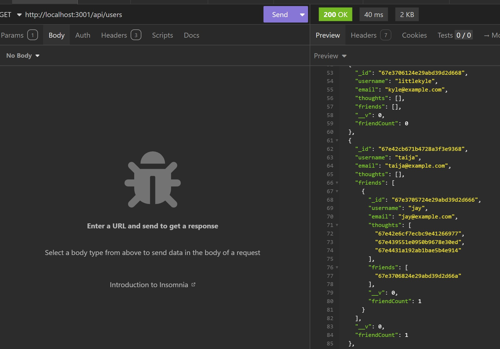
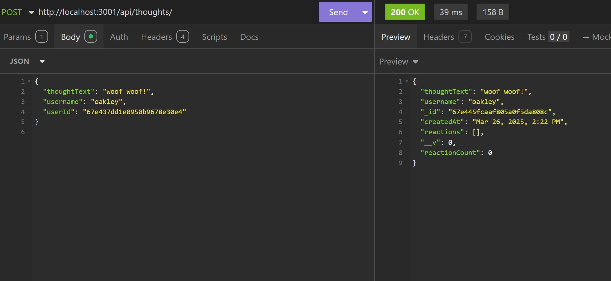
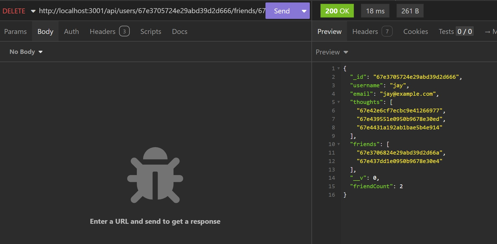

# Call Of Coding

## Table of Contents
- [Description](#description)
- [Screenshots](#screenshots)
- [Installation](#installation)
- [Usage](#usage)
- [License](#license)
- [Contributing](#contributing)
- [Tests](#tests)
- [Credit](#credit)
- [Project Links](#project-links)
- [Questions](#questions)

## Description

A social network web application where users can share their thoughts, react to friends' thoughts, and create a friend list.

## Screenshots

Here are some previews of the api requests:

###  Get all users

### Add new thought

### Delete friend

## Installation

1. Clone the repository: https://github.com/taijamartinez/socialNetwork

   
2. Install dependencies by running npm install in your terminal.

3. Run npm build in your terminal.

4. Start the development server: 
   npm run dev in your terminal.

5. Open Insomnia.

6. Make sure your route always starts with http://localhost:3001/api/

## Usage

1. Start the development for the Social Network.

2. Use Insomnia to create, read, update and delete users, thoughts, friends and reactions.

## License

This application is covered under the MIT license.

## Contributing

If you would like to contribute to my project please follow these steps!

1. Fork the repository on GitHub.
2. Clone your fork to your computer.
3. Create a new branch for your changes.
4. Make your changes and commit them using descriptive messages.
5. Push your branch and open a pull request!

## Tests

1. start the development.
2. With Insomnia make sure all routes work.

## Credit

-ChatGPT helped with the package.json and tsconfig file to make sure everything would run correctly.

## Project Links

Repository: https://github.com/taijamartinez/socialNetwork  
Project Screen Recording: https://drive.google.com/file/d/1oxqnbFKO9zeiQ-xqWdmLLIP4R559Ophh/view

## Questions

Please reach me here with additional questions:

GitHub: https://github.com/taijamartinez  
Email: taijasmartinez@gmail.com 

Happy coding! 🚀 
